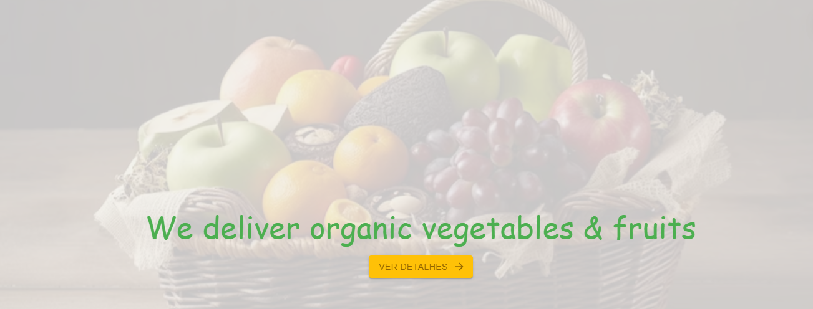

# VegeFoods - E-Commerce and Food Delivery Site

Welcome to VegeFoods, an e-commerce and food delivery website specializing in vegetarian and vegan products. This repository contains the VegeFoods front-end code, developed using React, React Spring and Material-UI technologies.

![VegeFoods Banner]

## Content

- [Overview](https://chat.openai.com/?model=text-davinci-002-render-sha#vis%C3%A3o-geral)
     - [Description](https://chat.openai.com/?model=text-davinci-002-render-sha#descri%C3%A7%C3%A3o)
     - [Functionalities](https://chat.openai.com/?model=text-davinci-002-render-sha#functionalities)
     - [Used Technologies](https://chat.openai.com/?model=text-davinci-002-render-sha#utilized technologies)
- [Installation](https://chat.openai.com/?model=text-davinci-002-render-sha#installs%C3%A7%C3%A3o)
- [Usage](https://chat.openai.com/?model=text-davinci-002-render-sha#usage)
- [Contribution](https://chat.openai.com/?model=text-davinci-002-render-sha#contribution%C3%A7%C3%A3o)
- [License](https://chat.openai.com/?model=text-davinci-002-render-sha#licen%C3%A7a)

## Overview

### Description

VegeFoods is an e-commerce and food delivery platform that aims to offer a wide range of vegetarian and vegan products, making it easy for users to find and buy their favorite items without leaving their homes. The platform was developed with a focus on providing an intuitive and pleasant user experience, in addition to encouraging a healthy and sustainable lifestyle.

### Functionalities

- Easy and intuitive navigation.
- Responsiveness for an optimized experience on mobile and desktop devices.

### Technologies Used

VegeFoods was developed with the following technologies:

- [React](https://reactjs.org/): Open source JavaScript library for creating user interfaces.
- [React Spring](https://www.react-spring.io/): Library for fluid animations in React components.
- [Material-UI](https://material-ui.com/): A UI framework for React that implements Material Design.

## Installation

To run the project locally, follow the steps below:

1. Make sure you have Node.js and npm (Node Package Manager) installed on your system.
2. Clone this repository on your local machine using the following command:

bashCopy code

`git clone https://github.com/your-user/vegefoods.git`

3. Navigate to the project directory:

bashCopy code

`cd vegefoods`

4. Install the required dependencies:

bashCopy code

`npm install`

## Usage

After completing the installation, you can start the development server to run VegeFoods locally. Use the following command:

bashCopy code

`npm start`

Access the site in your browser at `http://localhost:3000` and you will be able to view and interact with VegeFoods.

## Contribution

Contributions are welcome! If you want to improve VegeFoods, follow the steps below:

1. Fork this repository.
2. Create a branch for your feature: `git checkout -b feature/feature-name`.
3. Make the necessary changes and additions.
4. Commit your changes: `git commit -m 'Adding a new feature'`.
5. Push to master branch: `git push origin feature/feature-name`.
6. Open a pull request, describing your changes in detail.

## License

This project is licensed under the [MIT License](https://chat.openai.com/link_to_license_file), which means you can freely use, modify and distribute it as you need.

----------

Thank you for choosing VegeFoods! We hope you enjoy your experience on our website. If you have any questions or need support, please feel free to contact our support team.

Have fun shopping for quality vegetarian and vegan products!

![VegeFoods Logo][def]

[def]: src/asssets/images/logo.svg